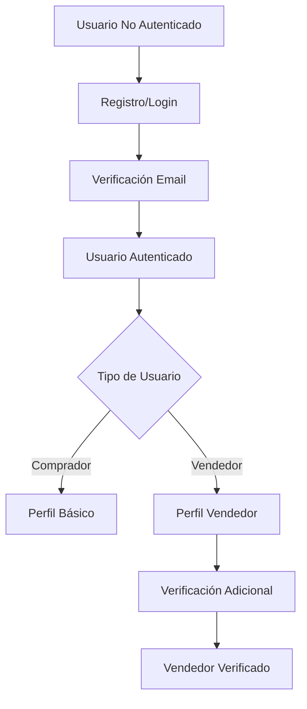
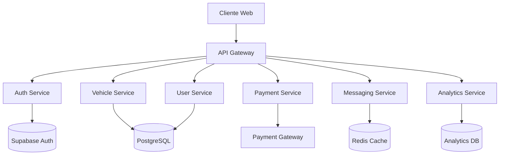

# Análisis de Arquitectura y Plan de Mejoras - Naveo Marketplace

## 📊 Análisis de la Arquitectura Actual

### Stack Tecnológico
- **Frontend**: React + TypeScript + Vite
- **UI Components**: Shadcn/ui + Tailwind CSS
- **Routing**: React Router v6
- **Estado**: React Query (TanStack Query)
- **Backend**: Supabase (Edge Functions)
- **IA**: Lovable AI Gateway (Google Gemini 2.5 Flash)

### Estructura del Proyecto

```
src/
├── components/       # Componentes reutilizables
├── pages/           # Páginas principales
├── integrations/    # Integración con Supabase
├── hooks/           # Custom hooks
└── lib/             # Utilidades

supabase/
└── functions/       # Edge Functions (solo chat actualmente)
```

### Funcionalidades Actuales

1. **Landing Page** (`/`)
   - Hero section
   - Features
   - Testimonials
   - FAQ
   - Chat de asistencia (Naveo Care)

2. **Listado de Vehículos** (`/vehiculos`)
   - Datos hardcodeados (6 vehículos de ejemplo)
   - Filtros funcionales (búsqueda, tipo, ciudad, precio, año)
   - Vista en grid responsiva

3. **Publicar Vehículo** (`/publicar`)
   - Formulario completo con validaciones
   - Carga de imágenes (solo preview, no se suben)
   - Sin persistencia real

4. **Detalle de Vehículo** (`/vehiculo/:id`)
   - Página implementada pero sin datos dinámicos

5. **Chat de Asistencia** (Naveo Care)
   - Integración con IA para consultas mecánicas
   - Streaming de respuestas
   - Persistencia solo en memoria

### Limitaciones Actuales

1. **Sin Base de Datos**
   - Todos los datos están hardcodeados
   - No hay persistencia de vehículos publicados
   - Sin gestión de usuarios

2. **Sin Autenticación**
   - No hay sistema de login/registro
   - Sin roles (vendedor/comprador/admin)
   - Sin perfiles de usuario

3. **Sin Sistema de Pagos**
   - No hay integración con pasarelas de pago
   - Sin sistema de comisiones
   - Sin gestión de transacciones

4. **Sin Funcionalidades de Marketplace**
   - Sin mensajería entre usuarios
   - Sin sistema de favoritos
   - Sin historial de búsquedas
   - Sin notificaciones
   - Sin sistema de calificaciones

## 🎯 Funcionalidades Faltantes para un Marketplace Completo

### 1. Sistema de Usuarios y Autenticación
- Registro/Login con email y contraseña
- Login social (Google, Facebook)
- Verificación de email
- Recuperación de contraseña
- Perfiles de usuario con foto y datos
- Roles: Comprador, Vendedor, Admin

### 2. Gestión de Vehículos
- CRUD completo de vehículos en base de datos
- Upload real de imágenes a Supabase Storage
- Estados de publicación (activo, pausado, vendido)
- Historial de cambios
- Vehículos destacados/promocionados

### 3. Sistema de Búsqueda Avanzada
- Búsqueda por múltiples criterios
- Guardado de búsquedas
- Alertas de nuevos vehículos
- Ordenamiento (precio, fecha, relevancia)
- Paginación

### 4. Interacciones Usuario-Usuario
- Sistema de mensajería interna
- Preguntas y respuestas en publicaciones
- Sistema de ofertas/negociación
- Compartir en redes sociales

### 5. Sistema de Pagos y Monetización
- Publicaciones gratuitas limitadas
- Planes de suscripción para vendedores
- Publicaciones destacadas (pago)
- Comisión por venta
- Integración con pasarelas de pago (MercadoPago, PayU)

### 6. Seguridad y Confianza
- Verificación de identidad de vendedores
- Sistema de calificaciones y reseñas
- Reportar publicaciones fraudulentas
- Moderación de contenido
- Términos y condiciones

### 7. Analytics y Reportes
- Dashboard para vendedores
- Estadísticas de visitas
- Conversión de leads
- Reportes de ventas
- Analytics para administradores

## 🗄️ Diseño del Modelo de Datos en Supabase

### Tablas Principales

```sql
-- Usuarios
CREATE TABLE users (
  id UUID PRIMARY KEY DEFAULT uuid_generate_v4(),
  email TEXT UNIQUE NOT NULL,
  full_name TEXT NOT NULL,
  phone TEXT,
  avatar_url TEXT,
  role TEXT DEFAULT 'buyer', -- buyer, seller, admin
  verified BOOLEAN DEFAULT false,
  created_at TIMESTAMP DEFAULT NOW(),
  updated_at TIMESTAMP DEFAULT NOW()
);

-- Perfiles de vendedor
CREATE TABLE seller_profiles (
  id UUID PRIMARY KEY DEFAULT uuid_generate_v4(),
  user_id UUID REFERENCES users(id) ON DELETE CASCADE,
  business_name TEXT,
  business_type TEXT, -- individual, dealership
  rating DECIMAL(3,2) DEFAULT 0,
  total_sales INTEGER DEFAULT 0,
  verified_seller BOOLEAN DEFAULT false,
  subscription_plan TEXT DEFAULT 'free', -- free, basic, premium
  subscription_expires_at TIMESTAMP,
  created_at TIMESTAMP DEFAULT NOW()
);

-- Vehículos
CREATE TABLE vehicles (
  id UUID PRIMARY KEY DEFAULT uuid_generate_v4(),
  seller_id UUID REFERENCES users(id) ON DELETE CASCADE,
  title TEXT NOT NULL,
  description TEXT,
  type TEXT NOT NULL, -- sedan, suv, moto, etc
  brand TEXT NOT NULL,
  model TEXT NOT NULL,
  year INTEGER NOT NULL,
  price DECIMAL(12,2) NOT NULL,
  mileage INTEGER,
  city TEXT NOT NULL,
  state TEXT NOT NULL,
  transmission TEXT,
  fuel_type TEXT,
  color TEXT,
  doors INTEGER,
  condition TEXT,
  status TEXT DEFAULT 'active', -- active, paused, sold, expired
  views INTEGER DEFAULT 0,
  featured BOOLEAN DEFAULT false,
  featured_until TIMESTAMP,
  created_at TIMESTAMP DEFAULT NOW(),
  updated_at TIMESTAMP DEFAULT NOW()
);

-- Imágenes de vehículos
CREATE TABLE vehicle_images (
  id UUID PRIMARY KEY DEFAULT uuid_generate_v4(),
  vehicle_id UUID REFERENCES vehicles(id) ON DELETE CASCADE,
  url TEXT NOT NULL,
  is_primary BOOLEAN DEFAULT false,
  order_index INTEGER DEFAULT 0,
  created_at TIMESTAMP DEFAULT NOW()
);

-- Favoritos
CREATE TABLE favorites (
  id UUID PRIMARY KEY DEFAULT uuid_generate_v4(),
  user_id UUID REFERENCES users(id) ON DELETE CASCADE,
  vehicle_id UUID REFERENCES vehicles(id) ON DELETE CASCADE,
  created_at TIMESTAMP DEFAULT NOW(),
  UNIQUE(user_id, vehicle_id)
);

-- Mensajes
CREATE TABLE conversations (
  id UUID PRIMARY KEY DEFAULT uuid_generate_v4(),
  vehicle_id UUID REFERENCES vehicles(id) ON DELETE CASCADE,
  buyer_id UUID REFERENCES users(id) ON DELETE CASCADE,
  seller_id UUID REFERENCES users(id) ON DELETE CASCADE,
  last_message_at TIMESTAMP,
  created_at TIMESTAMP DEFAULT NOW()
);

CREATE TABLE messages (
  id UUID PRIMARY KEY DEFAULT uuid_generate_v4(),
  conversation_id UUID REFERENCES conversations(id) ON DELETE CASCADE,
  sender_id UUID REFERENCES users(id) ON DELETE CASCADE,
  content TEXT NOT NULL,
  read BOOLEAN DEFAULT false,
  created_at TIMESTAMP DEFAULT NOW()
);

-- Transacciones
CREATE TABLE transactions (
  id UUID PRIMARY KEY DEFAULT uuid_generate_v4(),
  vehicle_id UUID REFERENCES vehicles(id),
  buyer_id UUID REFERENCES users(id),
  seller_id UUID REFERENCES users(id),
  amount DECIMAL(12,2) NOT NULL,
  commission DECIMAL(12,2),
  payment_method TEXT,
  status TEXT DEFAULT 'pending', -- pending, completed, failed, refunded
  created_at TIMESTAMP DEFAULT NOW()
);

-- Calificaciones
CREATE TABLE ratings (
  id UUID PRIMARY KEY DEFAULT uuid_generate_v4(),
  transaction_id UUID REFERENCES transactions(id),
  rater_id UUID REFERENCES users(id),
  rated_id UUID REFERENCES users(id),
  rating INTEGER CHECK (rating >= 1 AND rating <= 5),
  comment TEXT,
  created_at TIMESTAMP DEFAULT NOW()
);

-- Reportes
CREATE TABLE reports (
  id UUID PRIMARY KEY DEFAULT uuid_generate_v4(),
  reporter_id UUID REFERENCES users(id),
  vehicle_id UUID REFERENCES vehicles(id),
  reason TEXT NOT NULL,
  description TEXT,
  status TEXT DEFAULT 'pending', -- pending, reviewed, resolved
  created_at TIMESTAMP DEFAULT NOW()
);
```

### Row Level Security (RLS)

```sql
-- Políticas de seguridad para cada tabla
-- Ejemplo para vehicles:
ALTER TABLE vehicles ENABLE ROW LEVEL SECURITY;

-- Ver vehículos activos
CREATE POLICY "Public vehicles are viewable by everyone" 
ON vehicles FOR SELECT 
USING (status = 'active');

-- Crear vehículos (solo usuarios autenticados)
CREATE POLICY "Users can create their own vehicles" 
ON vehicles FOR INSERT 
WITH CHECK (auth.uid() = seller_id);

-- Actualizar vehículos (solo el dueño)
CREATE POLICY "Users can update their own vehicles" 
ON vehicles FOR UPDATE 
USING (auth.uid() = seller_id);
```

## 🔐 Sistema de Autenticación y Roles

### Flujo de Autenticación



### Roles y Permisos

1. **Visitante (No autenticado)**
   - Ver vehículos públicos
   - Buscar y filtrar
   - Ver detalles
   - Usar chat de asistencia

2. **Comprador (Autenticado)**
   - Todo lo anterior +
   - Guardar favoritos
   - Contactar vendedores
   - Ver historial
   - Calificar vendedores

3. **Vendedor**
   - Todo lo anterior +
   - Publicar vehículos
   - Gestionar publicaciones
   - Ver estadísticas
   - Responder mensajes
   - Gestionar perfil de vendedor

4. **Vendedor Premium**
   - Todo lo anterior +
   - Publicaciones ilimitadas
   - Destacar vehículos
   - Analytics avanzados
   - Soporte prioritario

5. **Administrador**
   - Gestión completa
   - Moderación de contenido
   - Gestión de usuarios
   - Reportes y analytics
   - Configuración del sistema

## 🏗️ Arquitectura de Backend y APIs

### Edge Functions Necesarias

```typescript
// 1. Autenticación
/auth/register
/auth/login
/auth/verify-email
/auth/reset-password

// 2. Usuarios
/users/profile
/users/update-profile
/users/upgrade-to-seller

// 3. Vehículos
/vehicles/list
/vehicles/create
/vehicles/update
/vehicles/delete
/vehicles/search
/vehicles/featured

// 4. Interacciones
/favorites/toggle
/messages/send
/messages/list
/ratings/create

// 5. Pagos
/payments/create-checkout
/payments/webhook
/subscriptions/upgrade

// 6. Admin
/admin/users
/admin/vehicles
/admin/reports
/admin/analytics
```

### Arquitectura de Microservicios



## 💰 Sistema de Pagos y Monetización

### Modelo de Monetización

1. **Publicaciones Gratuitas**
   - 3 publicaciones gratuitas por mes
   - Duración: 30 días
   - Sin destacar

2. **Plan Básico ($X/mes)**
   - 10 publicaciones por mes
   - Duración: 60 días
   - 1 destacada por semana

3. **Plan Premium ($Y/mes)**
   - Publicaciones ilimitadas
   - Duración: 90 días
   - 5 destacadas por semana
   - Analytics avanzados

4. **Servicios Adicionales**
   - Destacar publicación: $Z
   - Renovar publicación: $W
   - Verificación express: $V

### Integración de Pagos

```typescript
// Flujo de pago con MercadoPago
interface PaymentFlow {
  1. createPreference(item: Vehicle, plan: SubscriptionPlan)
  2. redirectToCheckout(preferenceId: string)
  3. handleWebhook(notification: MPNotification)
  4. updateSubscription(userId: string, plan: string)
  5. activateFeatures(userId: string)
}
```

## 📈 Plan de Implementación por Fases

### Fase 1: Base de Datos y Autenticación (2-3 semanas)
- [ ] Configurar tablas en Supabase
- [ ] Implementar RLS policies
- [ ] Sistema de autenticación completo
- [ ] Migrar datos hardcodeados a DB
- [ ] CRUD básico de vehículos

### Fase 2: Funcionalidades Core (3-4 semanas)
- [ ] Upload real de imágenes
- [ ] Sistema de búsqueda avanzada
- [ ] Favoritos
- [ ] Perfiles de usuario
- [ ] Paginación y ordenamiento

### Fase 3: Interacciones Sociales (2-3 semanas)
- [ ] Sistema de mensajería
- [ ] Preguntas y respuestas
- [ ] Calificaciones y reseñas
- [ ] Compartir en redes

### Fase 4: Monetización (3-4 semanas)
- [ ] Integración con pasarela de pagos
- [ ] Sistema de suscripciones
- [ ] Publicaciones destacadas
- [ ] Dashboard de vendedor

### Fase 5: Seguridad y Confianza (2 semanas)
- [ ] Verificación de usuarios
- [ ] Sistema de reportes
- [ ] Moderación de contenido
- [ ] Términos y condiciones

### Fase 6: Analytics y Optimización (2 semanas)
- [ ] Dashboard administrativo
- [ ] Analytics para vendedores
- [ ] Reportes de ventas
- [ ] Optimización de performance

## 🎨 Mejoras de UX/UI Necesarias

### 1. Diseño Responsivo Mejorado
- Optimización para móviles
- App-like experience
- Gestos táctiles

### 2. Mejoras en la Navegación
- Breadcrumbs
- Filtros persistentes
- Búsqueda predictiva
- Navegación por categorías

### 3. Elementos de Confianza
- Badges de verificación
- Indicadores de respuesta
- Tiempo en la plataforma
- Número de ventas

### 4. Optimización de Conversión
- CTAs más claros
- Proceso de publicación simplificado
- Onboarding para nuevos usuarios
- Tour guiado

### 5. Accesibilidad
- ARIA labels
- Navegación por teclado
- Alto contraste
- Lectores de pantalla

## 🔧 Mejoras Técnicas

### 1. Performance
- Lazy loading de imágenes
- Code splitting
- Caché de búsquedas
- Optimización de queries

### 2. SEO
- Meta tags dinámicos
- Sitemap
- Schema.org markup
- URLs amigables

### 3. PWA
- Service workers
- Offline functionality
- Push notifications
- Install prompt

### 4. Monitoreo
- Error tracking (Sentry)
- Analytics (Google Analytics)
- Performance monitoring
- User session recording

## 📊 KPIs para Medir Éxito

1. **Métricas de Negocio**
   - Número de vehículos publicados
   - Tasa de conversión (visita a contacto)
   - Valor promedio de transacción
   - Revenue por usuario

2. **Métricas de Engagement**
   - DAU/MAU
   - Tiempo en la plataforma
   - Páginas por sesión
   - Tasa de retorno

3. **Métricas de Calidad**
   - NPS (Net Promoter Score)
   - Tasa de resolución de disputas
   - Tiempo de respuesta promedio
   - Satisfacción del usuario

## 🚀 Próximos Pasos

1. **Validar el plan con stakeholders**
2. **Priorizar features según ROI**
3. **Definir MVP para lanzamiento**
4. **Establecer equipo de desarrollo**
5. **Crear roadmap detallado**
6. **Iniciar Fase 1**

---

Este documento será actualizado conforme avance el desarrollo del proyecto.