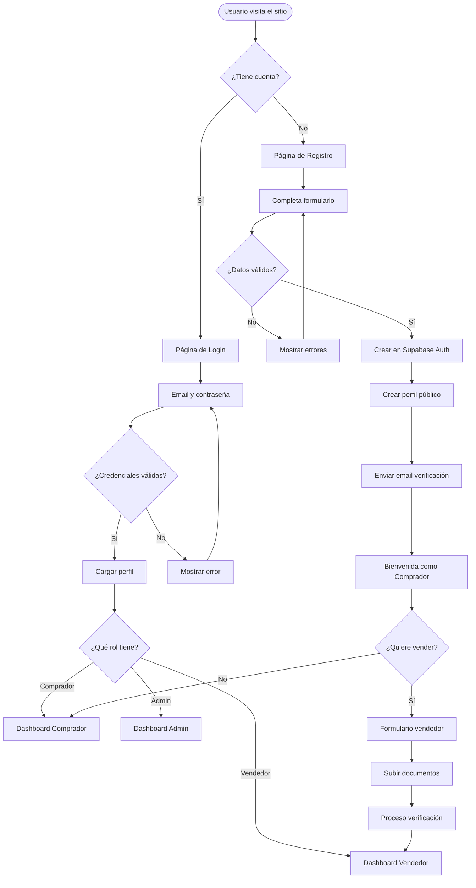
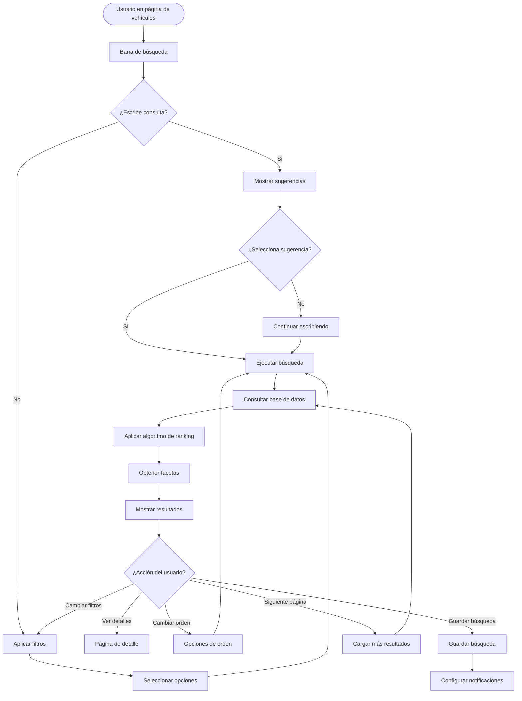

# Plan de Implementación - Naveo Marketplace

## 📋 Resumen Ejecutivo

Este documento define el plan de implementación para las tres funcionalidades prioritarias del marketplace:

1. **Sistema de Usuarios y Autenticación**
2. **Gestión de Vehículos (CRUD completo)**
3. **Sistema de Búsqueda Avanzada**

## 🎯 Objetivos del Proyecto

- Transformar la aplicación actual en un marketplace funcional
- Implementar autenticación robusta con roles diferenciados
- Permitir publicación y gestión completa de vehículos
- Ofrecer búsqueda avanzada con filtros y relevancia

## 📊 Diagramas de Flujo

### 1. Flujo de Registro y Autenticación



### 2. Flujo de Publicación de Vehículo

```mermaid
flowchart TD
    Start([Vendedor autenticado]) --> PublishBtn[Click "Publicar Vehículo"]
    PublishBtn --> CheckPlan{¿Tiene publicaciones disponibles?}
    
    CheckPlan -->|No| ShowPlans[Mostrar planes]
    ShowPlans --> SelectPlan[Seleccionar plan]
    SelectPlan --> Payment[Proceso de pago]
    Payment --> CheckPlan
    
    CheckPlan -->|Sí| VehicleForm[Formulario de vehículo]
    VehicleForm --> BasicInfo[Información básica]
    BasicInfo --> TechSpecs[Especificaciones técnicas]
    TechSpecs --> UploadImages[Subir imágenes]
    UploadImages --> Preview[Vista previa]
    
    Preview --> SaveDraft{¿Guardar borrador?}
    SaveDraft -->|Sí| DraftSaved[Guardado como borrador]
    SaveDraft -->|No| Publish{¿Publicar ahora?}
    
    Publish -->|No| DraftSaved
    Publish -->|Sí| ValidateData{¿Datos completos?}
    ValidateData -->|No| ShowErrors[Mostrar campos faltantes]
    ShowErrors --> VehicleForm
    
    ValidateData -->|Sí| CreateVehicle[Crear en BD]
    CreateVehicle --> ProcessImages[Procesar imágenes]
    ProcessImages --> SetActive[Estado: Activo]
    SetActive --> NotifyUser[Notificar éxito]
    NotifyUser --> VehicleList[Lista de vehículos]
```

### 3. Flujo de Búsqueda y Filtrado



## 🗓️ Cronograma de Implementación

### Fase 1: Configuración Base (Semana 1)

#### Día 1-2: Setup del Proyecto
- [ ] Configurar Supabase con el proyecto
- [ ] Crear estructura de carpetas para servicios
- [ ] Configurar variables de entorno
- [ ] Instalar dependencias adicionales necesarias

#### Día 3-5: Base de Datos
- [ ] Crear todas las tablas en Supabase
- [ ] Configurar RLS policies
- [ ] Crear triggers y funciones
- [ ] Poblar datos de prueba

### Fase 2: Sistema de Autenticación (Semana 2-3)

#### Semana 2: Auth Backend
- [ ] Implementar AuthService completo
- [ ] Crear páginas de login/registro
- [ ] Implementar verificación de email
- [ ] Crear sistema de roles

#### Semana 3: Perfiles y Verificación
- [ ] Implementar gestión de perfiles
- [ ] Sistema de upgrade a vendedor
- [ ] Upload de documentos
- [ ] Panel de verificación admin

### Fase 3: Gestión de Vehículos (Semana 4-6)

#### Semana 4: CRUD Backend
- [ ] Implementar VehicleService
- [ ] Sistema de upload de imágenes
- [ ] Procesamiento y optimización de imágenes
- [ ] Historial de cambios

#### Semana 5: UI de Publicación
- [ ] Refactorizar formulario de publicación
- [ ] Implementar guardado en BD real
- [ ] Vista previa mejorada
- [ ] Validaciones completas

#### Semana 6: Gestión de Vehículos
- [ ] Dashboard del vendedor
- [ ] Lista de vehículos propios
- [ ] Edición de vehículos
- [ ] Cambios de estado

### Fase 4: Sistema de Búsqueda (Semana 7-9)

#### Semana 7: Backend de Búsqueda
- [ ] Implementar SearchService
- [ ] Configurar búsqueda full-text
- [ ] Sistema de facetas
- [ ] Algoritmo de ranking

#### Semana 8: UI de Búsqueda
- [ ] Refactorizar componente de búsqueda
- [ ] Implementar filtros avanzados
- [ ] Autocompletado y sugerencias
- [ ] Resultados con paginación

#### Semana 9: Optimización
- [ ] Caché de búsquedas
- [ ] Vista materializada
- [ ] Índices optimizados
- [ ] Tests de performance

### Fase 5: Integración y Testing (Semana 10)

- [ ] Integración completa de componentes
- [ ] Testing end-to-end
- [ ] Corrección de bugs
- [ ] Optimización de performance
- [ ] Documentación técnica

## 🛠️ Stack Técnico Detallado

### Frontend
```json
{
  "framework": "React 18 + TypeScript",
  "routing": "React Router v6",
  "ui": "Shadcn/ui + Tailwind CSS",
  "state": "TanStack Query + Zustand",
  "forms": "React Hook Form + Zod",
  "utils": "date-fns, clsx, lucide-react"
}
```

### Backend
```json
{
  "platform": "Supabase",
  "database": "PostgreSQL",
  "auth": "Supabase Auth",
  "storage": "Supabase Storage",
  "functions": "Edge Functions (Deno)",
  "realtime": "Supabase Realtime"
}
```

## 📁 Estructura de Carpetas Propuesta

```
src/
├── components/
│   ├── auth/
│   │   ├── LoginForm.tsx
│   │   ├── RegisterForm.tsx
│   │   ├── ProtectedRoute.tsx
│   │   └── VerificationUpload.tsx
│   ├── vehicles/
│   │   ├── VehicleForm.tsx
│   │   ├── VehicleCard.tsx
│   │   ├── VehicleManager.tsx
│   │   └── ImageUploader.tsx
│   ├── search/
│   │   ├── AdvancedSearch.tsx
│   │   ├── SearchBar.tsx
│   │   ├── FilterPanel.tsx
│   │   └── SearchResults.tsx
│   └── ui/
├── services/
│   ├── auth.service.ts
│   ├── vehicle.service.ts
│   ├── search.service.ts
│   ├── image.service.ts
│   └── notification.service.ts
├── hooks/
│   ├── useAuth.ts
│   ├── useVehicles.ts
│   ├── useSearch.ts
│   └── useDebounce.ts
├── types/
│   ├── auth.types.ts
│   ├── vehicle.types.ts
│   └── search.types.ts
├── utils/
│   ├── validators.ts
│   ├── formatters.ts
│   └── constants.ts
└── pages/
    ├── auth/
    ├── dashboard/
    └── vehicles/
```

## 🔧 Configuración de Supabase

### 1. Políticas RLS Esenciales

```sql
-- Profiles: Lectura pública, escritura propia
CREATE POLICY "Profiles are viewable by everyone" 
ON profiles FOR SELECT USING (true);

CREATE POLICY "Users can update own profile" 
ON profiles FOR UPDATE USING (auth.uid() = id);

-- Vehicles: CRUD según rol
CREATE POLICY "Active vehicles are viewable by everyone" 
ON vehicles FOR SELECT USING (status = 'active');

CREATE POLICY "Sellers can manage own vehicles" 
ON vehicles FOR ALL USING (
  auth.uid() = seller_id 
  AND EXISTS (
    SELECT 1 FROM profiles 
    WHERE id = auth.uid() 
    AND role IN ('seller', 'admin')
  )
);

-- Images: Acceso según vehículo
CREATE POLICY "Vehicle images follow vehicle policies" 
ON vehicle_images FOR ALL USING (
  EXISTS (
    SELECT 1 FROM vehicles 
    WHERE id = vehicle_id 
    AND (status = 'active' OR seller_id = auth.uid())
  )
);
```

### 2. Funciones de Base de Datos

```sql
-- Función para crear perfil automáticamente
CREATE OR REPLACE FUNCTION handle_new_user() 
RETURNS trigger AS $$
BEGIN
  INSERT INTO public.profiles (id, email, full_name)
  VALUES (
    new.id, 
    new.email,
    new.raw_user_meta_data->>'full_name'
  );
  RETURN new;
END;
$$ LANGUAGE plpgsql SECURITY DEFINER;

-- Trigger para nuevos usuarios
CREATE TRIGGER on_auth_user_created
  AFTER INSERT ON auth.users
  FOR EACH ROW EXECUTE FUNCTION handle_new_user();

-- Función para actualizar contadores
CREATE OR REPLACE FUNCTION increment_vehicle_view()
RETURNS void AS $$
BEGIN
  UPDATE vehicles 
  SET views_count = views_count + 1,
      updated_at = updated_at -- No cambiar fecha
  WHERE id = $1;
END;
$$ LANGUAGE plpgsql;
```

### 3. Índices para Performance

```sql
-- Índices compuestos para búsquedas comunes
CREATE INDEX idx_vehicles_search_filters 
ON vehicles(status, type, brand, city) 
WHERE status = 'active';

CREATE INDEX idx_vehicles_price_year 
ON vehicles(price, year) 
WHERE status = 'active';

-- Índice para ordenamiento
CREATE INDEX idx_vehicles_featured_created 
ON vehicles(is_featured DESC, created_at DESC) 
WHERE status = 'active';
```

## 📊 Métricas de Éxito

### KPIs Técnicos
- Tiempo de carga de búsqueda: < 500ms
- Tiempo de upload de imagen: < 3s
- Tasa de error en autenticación: < 1%
- Uptime del sistema: > 99.9%

### KPIs de Negocio
- Tasa de conversión registro → publicación: > 30%
- Vehículos publicados por día: > 50
- Búsquedas por usuario: > 5
- Tasa de contacto: > 10%

## 🚀 Próximos Pasos Inmediatos

1. **Configurar Supabase**
   - Crear proyecto en Supabase
   - Obtener API keys
   - Configurar dominio personalizado

2. **Preparar Entorno Local**
   ```bash
   # Instalar Supabase CLI
   npm install -g supabase
   
   # Inicializar Supabase local
   supabase init
   
   # Crear migraciones
   supabase migration new initial_schema
   ```

3. **Actualizar Cliente Supabase**
   ```typescript
   // src/integrations/supabase/client.ts
   import { createClient } from '@supabase/supabase-js'
   import { Database } from './types'
   
   export const supabase = createClient<Database>(
     import.meta.env.VITE_SUPABASE_URL,
     import.meta.env.VITE_SUPABASE_ANON_KEY
   )
   ```

4. **Crear Servicios Base**
   - Implementar AuthService
   - Crear hooks de autenticación
   - Configurar rutas protegidas

## 📝 Notas Importantes

1. **Seguridad**
   - Implementar rate limiting en funciones críticas
   - Validar todos los inputs en frontend y backend
   - Usar HTTPS en producción
   - Implementar CSP headers

2. **Performance**
   - Implementar lazy loading de imágenes
   - Usar React.memo en componentes pesados
   - Implementar virtual scrolling para listas largas
   - Comprimir imágenes antes de subir

3. **UX**
   - Mostrar estados de carga claros
   - Implementar optimistic updates
   - Guardar borradores automáticamente
   - Mostrar mensajes de error útiles

4. **Escalabilidad**
   - Diseñar para 10,000+ vehículos
   - Preparar para múltiples idiomas
   - Considerar CDN para imágenes
   - Planear sharding de datos

---

Este plan está diseñado para ser ejecutado por un equipo de 2-3 desarrolladores full-stack en aproximadamente 10 semanas. Se recomienda revisar y ajustar según el progreso real y los recursos disponibles.