# Plan de Implementación Prioritario - Naveo Marketplace

## 🎯 Áreas de Enfoque Principal

1. **Sistema de Usuarios y Autenticación**
2. **Gestión de Vehículos (CRUD completo)**
3. **Sistema de Búsqueda Avanzada**

---

## 1. 🔐 Sistema de Usuarios y Autenticación

### Modelo de Datos Detallado

```sql
-- Extensión de la tabla auth.users de Supabase
CREATE TABLE public.profiles (
  id UUID PRIMARY KEY REFERENCES auth.users(id) ON DELETE CASCADE,
  email TEXT UNIQUE NOT NULL,
  full_name TEXT NOT NULL,
  phone TEXT,
  avatar_url TEXT,
  role TEXT DEFAULT 'buyer' CHECK (role IN ('buyer', 'seller', 'admin')),
  email_verified BOOLEAN DEFAULT false,
  phone_verified BOOLEAN DEFAULT false,
  created_at TIMESTAMP DEFAULT NOW(),
  updated_at TIMESTAMP DEFAULT NOW()
);

-- Información adicional para vendedores
CREATE TABLE public.seller_details (
  id UUID PRIMARY KEY DEFAULT uuid_generate_v4(),
  profile_id UUID UNIQUE REFERENCES profiles(id) ON DELETE CASCADE,
  business_name TEXT,
  business_type TEXT CHECK (business_type IN ('individual', 'dealership')),
  ruc_dni TEXT,
  address TEXT,
  city TEXT,
  department TEXT,
  rating DECIMAL(3,2) DEFAULT 0,
  total_sales INTEGER DEFAULT 0,
  response_time_hours INTEGER,
  verified_at TIMESTAMP,
  verified_by UUID REFERENCES profiles(id),
  active BOOLEAN DEFAULT true,
  created_at TIMESTAMP DEFAULT NOW()
);

-- Documentos de verificación
CREATE TABLE public.verification_documents (
  id UUID PRIMARY KEY DEFAULT uuid_generate_v4(),
  profile_id UUID REFERENCES profiles(id) ON DELETE CASCADE,
  document_type TEXT CHECK (document_type IN ('dni', 'ruc', 'license', 'utility_bill')),
  document_url TEXT NOT NULL,
  status TEXT DEFAULT 'pending' CHECK (status IN ('pending', 'approved', 'rejected')),
  reviewed_at TIMESTAMP,
  reviewed_by UUID REFERENCES profiles(id),
  rejection_reason TEXT,
  created_at TIMESTAMP DEFAULT NOW()
);

-- Sesiones y dispositivos
CREATE TABLE public.user_sessions (
  id UUID PRIMARY KEY DEFAULT uuid_generate_v4(),
  profile_id UUID REFERENCES profiles(id) ON DELETE CASCADE,
  device_info JSONB,
  ip_address INET,
  last_activity TIMESTAMP DEFAULT NOW(),
  created_at TIMESTAMP DEFAULT NOW()
);
```

### Flujo de Autenticación Detallado

```mermaid
graph TD
    A[Inicio] --> B{Usuario Existente?}
    B -->|No| C[Registro]
    B -->|Sí| D[Login]
    
    C --> E[Formulario Registro]
    E --> F[Crear cuenta en Supabase Auth]
    F --> G[Crear perfil público]
    G --> H[Enviar email verificación]
    H --> I[Usuario creado - Rol: Comprador]
    
    D --> J[Formulario Login]
    J --> K{Credenciales válidas?}
    K -->|No| L[Mostrar error]
    K -->|Sí| M[Generar JWT]
    M --> N[Cargar perfil]
    N --> O[Redirigir según rol]
    
    I --> P{Quiere vender?}
    P -->|Sí| Q[Upgrade a Vendedor]
    Q --> R[Formulario datos vendedor]
    R --> S[Subir documentos]
    S --> T[Crear seller_details]
    T --> U[Proceso verificación]
    
    U --> V{Documentos válidos?}
    V -->|No| W[Solicitar corrección]
    V -->|Sí| X[Vendedor verificado]
```



### Implementación con Supabase Auth

```typescript
// auth.service.ts
import { supabase } from '@/integrations/supabase/client';

export class AuthService {
  // Registro de nuevo usuario
  async register(data: RegisterData) {
    // 1. Crear usuario en Supabase Auth
    const { data: authData, error: authError } = await supabase.auth.signUp({
      email: data.email,
      password: data.password,
      options: {
        data: {
          full_name: data.fullName,
          phone: data.phone
        }
      }
    });

    if (authError) throw authError;

    // 2. Crear perfil público (trigger automático recomendado)
    const { error: profileError } = await supabase
      .from('profiles')
      .insert({
        id: authData.user!.id,
        email: data.email,
        full_name: data.fullName,
        phone: data.phone,
        role: 'buyer'
      });

    if (profileError) throw profileError;

    return authData;
  }

  // Login
  async login(email: string, password: string) {
    const { data, error } = await supabase.auth.signInWithPassword({
      email,
      password
    });

    if (error) throw error;

    // Cargar perfil completo
    const profile = await this.getProfile(data.user.id);
    
    return { ...data, profile };
  }

  // Obtener perfil con datos de vendedor si aplica
  async getProfile(userId: string) {
    const { data: profile } = await supabase
      .from('profiles')
      .select(`
        *,
        seller_details (*)
      `)
      .eq('id', userId)
      .single();

    return profile;
  }

  // Upgrade a vendedor
  async upgradeToSeller(userId: string, sellerData: SellerData) {
    // 1. Actualizar rol en profiles
    await supabase
      .from('profiles')
      .update({ role: 'seller' })
      .eq('id', userId);

    // 2. Crear seller_details
    const { data, error } = await supabase
      .from('seller_details')
      .insert({
        profile_id: userId,
        ...sellerData
      });

    if (error) throw error;

    return data;
  }

  // Subir documentos de verificación
  async uploadVerificationDocument(
    userId: string, 
    file: File, 
    documentType: string
  ) {
    // 1. Subir archivo a Storage
    const fileName = `${userId}/${documentType}_${Date.now()}`;
    const { data: uploadData, error: uploadError } = await supabase.storage
      .from('verification-documents')
      .upload(fileName, file);

    if (uploadError) throw uploadError;

    // 2. Guardar referencia en DB
    const { data, error } = await supabase
      .from('verification_documents')
      .insert({
        profile_id: userId,
        document_type: documentType,
        document_url: uploadData.path
      });

    if (error) throw error;

    return data;
  }
}
```

### Componentes de UI para Auth

```typescript
// components/auth/RegisterForm.tsx
import { useState } from 'react';
import { useNavigate } from 'react-router-dom';
import { useForm } from 'react-hook-form';
import { zodResolver } from '@hookform/resolvers/zod';
import * as z from 'zod';
import { Button } from '@/components/ui/button';
import { Input } from '@/components/ui/input';
import { Form, FormControl, FormField, FormItem, FormLabel, FormMessage } from '@/components/ui/form';
import { useToast } from '@/hooks/use-toast';
import { AuthService } from '@/services/auth.service';

const registerSchema = z.object({
  email: z.string().email('Email inválido'),
  password: z.string().min(6, 'Mínimo 6 caracteres'),
  confirmPassword: z.string(),
  fullName: z.string().min(2, 'Nombre requerido'),
  phone: z.string().min(10, 'Teléfono inválido'),
  acceptTerms: z.boolean().refine(val => val === true, 'Debes aceptar los términos')
}).refine(data => data.password === data.confirmPassword, {
  message: 'Las contraseñas no coinciden',
  path: ['confirmPassword']
});

export function RegisterForm() {
  const [loading, setLoading] = useState(false);
  const navigate = useNavigate();
  const { toast } = useToast();
  const authService = new AuthService();

  const form = useForm<z.infer<typeof registerSchema>>({
    resolver: zodResolver(registerSchema),
    defaultValues: {
      email: '',
      password: '',
      confirmPassword: '',
      fullName: '',
      phone: '',
      acceptTerms: false
    }
  });

  async function onSubmit(values: z.infer<typeof registerSchema>) {
    setLoading(true);
    try {
      await authService.register({
        email: values.email,
        password: values.password,
        fullName: values.fullName,
        phone: values.phone
      });

      toast({
        title: '¡Cuenta creada!',
        description: 'Revisa tu email para verificar tu cuenta'
      });

      navigate('/login');
    } catch (error) {
      toast({
        title: 'Error',
        description: error.message,
        variant: 'destructive'
      });
    } finally {
      setLoading(false);
    }
  }

  return (
    <Form {...form}>
      <form onSubmit={form.handleSubmit(onSubmit)} className="space-y-4">
        {/* Campos del formulario */}
      </form>
    </Form>
  );
}
```

### Protección de Rutas

```typescript
// components/auth/ProtectedRoute.tsx
import { Navigate } from 'react-router-dom';
import { useAuth } from '@/hooks/useAuth';
import { Loader2 } from 'lucide-react';

interface ProtectedRouteProps {
  children: React.ReactNode;
  allowedRoles?: string[];
}

export function ProtectedRoute({ children, allowedRoles }: ProtectedRouteProps) {
  const { user, profile, loading } = useAuth();

  if (loading) {
    return (
      <div className="flex items-center justify-center min-h-screen">
        <Loader2 className="h-8 w-8 animate-spin" />
      </div>
    );
  }

  if (!user) {
    return <Navigate to="/login" replace />;
  }

  if (allowedRoles && !allowedRoles.includes(profile?.role)) {
    return <Navigate to="/unauthorized" replace />;
  }

  return <>{children}</>;
}

// Uso en App.tsx
<Route 
  path="/publicar" 
  element={
    <ProtectedRoute allowedRoles={['seller', 'admin']}>
      <PublishVehicle />
    </ProtectedRoute>
  } 
/>
```

---

## 2. 🚗 Gestión de Vehículos (CRUD Completo)

### Modelo de Datos Optimizado

```sql
-- Tabla principal de vehículos
CREATE TABLE public.vehicles (
  id UUID PRIMARY KEY DEFAULT uuid_generate_v4(),
  seller_id UUID REFERENCES profiles(id) ON DELETE CASCADE,
  
  -- Información básica
  title TEXT NOT NULL,
  slug TEXT UNIQUE NOT NULL, -- URL amigable
  description TEXT,
  
  -- Detalles del vehículo
  type TEXT NOT NULL,
  brand TEXT NOT NULL,
  model TEXT NOT NULL,
  year INTEGER NOT NULL CHECK (year >= 1900 AND year <= EXTRACT(YEAR FROM NOW()) + 1),
  price DECIMAL(12,2) NOT NULL CHECK (price > 0),
  negotiable BOOLEAN DEFAULT true,
  
  -- Especificaciones
  mileage INTEGER CHECK (mileage >= 0),
  transmission TEXT CHECK (transmission IN ('manual', 'automatic', 'semi-automatic')),
  fuel_type TEXT CHECK (fuel_type IN ('gasoline', 'diesel', 'electric', 'hybrid', 'gas')),
  engine_size TEXT,
  color TEXT,
  doors INTEGER CHECK (doors > 0),
  seats INTEGER CHECK (seats > 0),
  
  -- Condición
  condition TEXT CHECK (condition IN ('new', 'used-excellent', 'used-good', 'used-fair')),
  owners_count INTEGER DEFAULT 1,
  accident_history BOOLEAN DEFAULT false,
  service_history BOOLEAN DEFAULT false,
  
  -- Ubicación
  city TEXT NOT NULL,
  department TEXT NOT NULL,
  address TEXT, -- Opcional, para concesionarios
  latitude DECIMAL(10,8),
  longitude DECIMAL(11,8),
  
  -- Estado y visibilidad
  status TEXT DEFAULT 'draft' CHECK (status IN ('draft', 'active', 'paused', 'sold', 'expired')),
  published_at TIMESTAMP,
  expires_at TIMESTAMP,
  sold_at TIMESTAMP,
  
  -- Métricas
  views_count INTEGER DEFAULT 0,
  favorites_count INTEGER DEFAULT 0,
  inquiries_count INTEGER DEFAULT 0,
  
  -- Promoción
  is_featured BOOLEAN DEFAULT false,
  featured_until TIMESTAMP,
  boost_level INTEGER DEFAULT 0, -- 0: normal, 1-3: niveles de boost
  
  -- Metadatos
  created_at TIMESTAMP DEFAULT NOW(),
  updated_at TIMESTAMP DEFAULT NOW()
);

-- Índices para búsqueda eficiente
CREATE INDEX idx_vehicles_status ON vehicles(status);
CREATE INDEX idx_vehicles_type_brand ON vehicles(type, brand);
CREATE INDEX idx_vehicles_price ON vehicles(price);
CREATE INDEX idx_vehicles_location ON vehicles(city, department);
CREATE INDEX idx_vehicles_seller ON vehicles(seller_id);
CREATE INDEX idx_vehicles_featured ON vehicles(is_featured, featured_until);

-- Tabla de imágenes
CREATE TABLE public.vehicle_images (
  id UUID PRIMARY KEY DEFAULT uuid_generate_v4(),
  vehicle_id UUID REFERENCES vehicles(id) ON DELETE CASCADE,
  url TEXT NOT NULL,
  thumbnail_url TEXT,
  medium_url TEXT,
  position INTEGER DEFAULT 0,
  is_primary BOOLEAN DEFAULT false,
  created_at TIMESTAMP DEFAULT NOW()
);

-- Características adicionales (equipamiento)
CREATE TABLE public.vehicle_features (
  id UUID PRIMARY KEY DEFAULT uuid_generate_v4(),
  vehicle_id UUID REFERENCES vehicles(id) ON DELETE CASCADE,
  category TEXT NOT NULL, -- 'safety', 'comfort', 'entertainment', 'exterior'
  name TEXT NOT NULL,
  value TEXT
);

-- Historial de cambios
CREATE TABLE public.vehicle_history (
  id UUID PRIMARY KEY DEFAULT uuid_generate_v4(),
  vehicle_id UUID REFERENCES vehicles(id) ON DELETE CASCADE,
  user_id UUID REFERENCES profiles(id),
  action TEXT NOT NULL, -- 'created', 'updated', 'published', 'paused', 'sold'
  changes JSONB,
  created_at TIMESTAMP DEFAULT NOW()
);
```

### Servicio CRUD para Vehículos

```typescript
// services/vehicle.service.ts
import { supabase } from '@/integrations/supabase/client';

export class VehicleService {
  // Crear vehículo
  async createVehicle(data: VehicleCreateData, images: File[]) {
    const userId = (await supabase.auth.getUser()).data.user?.id;
    if (!userId) throw new Error('Usuario no autenticado');

    // 1. Crear vehículo
    const slug = this.generateSlug(data.title);
    const { data: vehicle, error } = await supabase
      .from('vehicles')
      .insert({
        ...data,
        seller_id: userId,
        slug,
        status: 'draft'
      })
      .select()
      .single();

    if (error) throw error;

    // 2. Subir imágenes
    const imagePromises = images.map((image, index) => 
      this.uploadVehicleImage(vehicle.id, image, index === 0)
    );
    await Promise.all(imagePromises);

    // 3. Registrar en historial
    await this.addHistory(vehicle.id, 'created', data);

    return vehicle;
  }

  // Actualizar vehículo
  async updateVehicle(vehicleId: string, updates: Partial<VehicleData>) {
    const { data, error } = await supabase
      .from('vehicles')
      .update({
        ...updates,
        updated_at: new Date().toISOString()
      })
      .eq('id', vehicleId)
      .select()
      .single();

    if (error) throw error;

    await this.addHistory(vehicleId, 'updated', updates);

    return data;
  }

  // Publicar vehículo
  async publishVehicle(vehicleId: string) {
    const expiresAt = new Date();
    expiresAt.setDate(expiresAt.getDate() + 30); // 30 días por defecto

    const { data, error } = await supabase
      .from('vehicles')
      .update({
        status: 'active',
        published_at: new Date().toISOString(),
        expires_at: expiresAt.toISOString()
      })
      .eq('id', vehicleId)
      .select()
      .single();

    if (error) throw error;

    await this.addHistory(vehicleId, 'published', { status: 'active' });

    return data;
  }

  // Marcar como vendido
  async markAsSold(vehicleId: string) {
    const { data, error } = await supabase
      .from('vehicles')
      .update({
        status: 'sold',
        sold_at: new Date().toISOString()
      })
      .eq('id', vehicleId)
      .select()
      .single();

    if (error) throw error;

    await this.addHistory(vehicleId, 'sold', { status: 'sold' });

    return data;
  }

  // Eliminar vehículo (soft delete)
  async deleteVehicle(vehicleId: string) {
    const { error } = await supabase
      .from('vehicles')
      .update({ status: 'deleted' })
      .eq('id', vehicleId);

    if (error) throw error;
  }

  // Obtener vehículos del vendedor
  async getSellerVehicles(sellerId: string, filters?: VehicleFilters) {
    let query = supabase
      .from('vehicles')
      .select(`
        *,
        vehicle_images (
          url,
          thumbnail_url,
          is_primary
        ),
        profiles!seller_id (
          full_name,
          avatar_url,
          seller_details (
            business_name,
            rating
          )
        )
      `)
      .eq('seller_id', sellerId)
      .order('created_at', { ascending: false });

    if (filters?.status) {
      query = query.eq('status', filters.status);
    }

    const { data, error } = await query;

    if (error) throw error;

    return data;
  }

  // Subir imagen
  private async uploadVehicleImage(
    vehicleId: string, 
    file: File, 
    isPrimary: boolean
  ) {
    // 1. Subir a Storage
    const fileName = `${vehicleId}/${Date.now()}_${file.name}`;
    const { data: uploadData, error: uploadError } = await supabase.storage
      .from('vehicle-images')
      .upload(fileName, file);

    if (uploadError) throw uploadError;

    // 2. Generar URLs públicas
    const { data: { publicUrl } } = supabase.storage
      .from('vehicle-images')
      .getPublicUrl(uploadData.path);

    // 3. Guardar en DB
    const { error } = await supabase
      .from('vehicle_images')
      .insert({
        vehicle_id: vehicleId,
        url: publicUrl,
        thumbnail_url: `${publicUrl}?width=300`, // Usar transform de Supabase
        medium_url: `${publicUrl}?width=800`,
        is_primary: isPrimary
      });

    if (error) throw error;
  }

  // Generar slug único
  private generateSlug(title: string): string {
    const baseSlug = title
      .toLowerCase()
      .replace(/[^a-z0-9]+/g, '-')
      .replace(/^-+|-+$/g, '');
    
    return `${baseSlug}-${Date.now()}`;
  }

  // Agregar al historial
  private async addHistory(
    vehicleId: string, 
    action: string, 
    changes: any
  ) {
    const userId = (await supabase.auth.getUser()).data.user?.id;
    
    await supabase
      .from('vehicle_history')
      .insert({
        vehicle_id: vehicleId,
        user_id: userId,
        action,
        changes
      });
  }
}
```

### Componente de Gestión de Vehículos

```typescript
// components/vehicles/VehicleManager.tsx
import { useState, useEffect } from 'react';
import { useNavigate } from 'react-router-dom';
import { Card, CardContent, CardHeader, CardTitle } from '@/components/ui/card';
import { Button } from '@/components/ui/button';
import { Badge } from '@/components/ui/badge';
import { Tabs, TabsContent, TabsList, TabsTrigger } from '@/components/ui/tabs';
import { 
  DropdownMenu, 
  DropdownMenuContent, 
  DropdownMenuItem, 
  DropdownMenuTrigger 
} from '@/components/ui/dropdown-menu';
import { MoreVertical, Edit, Pause, Play, Trash, Eye } from 'lucide-react';
import { VehicleService } from '@/services/vehicle.service';
import { useToast } from '@/hooks/use-toast';

export function VehicleManager() {
  const [vehicles, setVehicles] = useState([]);
  const [loading, setLoading] = useState(true);
  const [activeTab, setActiveTab] = useState('all');
  const navigate = useNavigate();
  const { toast } = useToast();
  const vehicleService = new VehicleService();

  useEffect(() => {
    loadVehicles();
  }, [activeTab]);

  async function loadVehicles() {
    try {
      const userId = (await supabase.auth.getUser()).data.user?.id;
      const filters = activeTab !== 'all' ? { status: activeTab } : undefined;
      const data = await vehicleService.getSellerVehicles(userId, filters);
      setVehicles(data);
    } catch (error) {
      toast({
        title: 'Error',
        description: 'No se pudieron cargar los vehículos',
        variant: 'destructive'
      });
    } finally {
      setLoading(false);
    }
  }

  async function handleStatusChange(vehicleId: string, newStatus: string) {
    try {
      if (newStatus === 'active') {
        await vehicleService.publishVehicle(vehicleId);
      } else if (newStatus === 'sold') {
        await vehicleService.markAsSold(vehicleId);
      } else {
        await vehicleService.updateVehicle(vehicleId, { status: newStatus });
      }
      
      toast({
        title: 'Estado actualizado',
        description: 'El vehículo ha sido actualizado correctamente'
      });
      
      loadVehicles();
    } catch (error) {
      toast({
        title: 'Error',
        description: 'No se pudo actualizar el estado',
        variant: 'destructive'
      });
    }
  }

  const getStatusBadge = (status: string) => {
    const variants = {
      draft: 'secondary',
      active: 'success',
      paused: 'warning',
      sold: 'default',
      expired: 'destructive'
    };

    const labels = {
      draft: 'Borrador',
      active: 'Activo',
      paused: 'Pausado',
      sold: 'Vendido',
      expired: 'Expirado'
    };

    return (
      <Badge variant={variants[status] || 'default'}>
        {labels[status] || status}
      </Badge>
    );
  };

  return (
    <div className="space-y-6">
      <div className="flex justify-between items-center">
        <h2 className="text-2xl font-bold">Mis Vehículos</h2>
        <Button onClick={() => navigate('/publicar')}>
          Publicar Vehículo
        </Button>
      </div>

      <Tabs value={activeTab} onValueChange={setActiveTab}>
        <TabsList>
          <TabsTrigger value="all">Todos</TabsTrigger>
          <TabsTrigger value="active">Activos</TabsTrigger>
          <TabsTrigger value="draft">Borradores</TabsTrigger>
          <TabsTrigger value="sold">Vendidos</TabsTrigger>
        </TabsList>

        <TabsContent value={activeTab} className="mt-6">
          <div className="grid gap-4">
            {vehicles.map((vehicle) => (
              <Card key={vehicle.id}>
                <CardContent className="p-6">
                  <div className="flex gap-4">
                    
                    
                    <div className="flex-1">
                      <div className="flex justify-between items-start">
                        <div>
                          <h3 className="font-semibold text-lg">{vehicle.title}</h3>
                          <p className="text-muted-foreground">
                            {vehicle.brand} {vehicle.model} • {vehicle.year}
                          </p>
                          <p className="text-xl font-bold mt-1">
                            ${vehicle.price.toLocaleString('es-CO')}
                          </p>
                        </div>
                        
                        <div className="flex items-center gap-2">
                          {getStatusBadge(vehicle.status)}
                          
                          <DropdownMenu>
                            <DropdownMenuTrigger asChild>
                              <Button variant="ghost" size="icon">
                                <MoreVertical className="h-4 w-4" />
                              </Button>
                            </DropdownMenuTrigger>
                            <DropdownMenuContent align="end">
                              <DropdownMenuItem onClick={() => navigate(`/vehiculo/${vehicle.id}`)}>
                                <Eye className="mr-2 h-4 w-4" />
                                Ver publicación
                              </DropdownMenuItem>
                              <DropdownMenuItem onClick={() => navigate(`/editar/${vehicle.id}`)}>
                                <Edit className="mr-2 h-4 w-4" />
                                Editar
                              </DropdownMenuItem>
                              
                              {vehicle.status === 'active' && (
                                <DropdownMenuItem onClick={() => handleStatusChange(vehicle.id, 'paused')}>
                                  <Pause className="mr-2 h-4 w-4" />
                                  Pausar
                                </DropdownMenuItem>
                              )}
                              
                              {vehicle.status === 'paused' && (
                                <DropdownMenuItem onClick={() => handleStatusChange(vehicle.id, 'active')}>
                                  <Play className="mr-2 h-4 w-4" />
                                  Reactivar
                                </DropdownMenuItem>
                              )}
                              
                              {vehicle.status !== 'sold' && (
                                <DropdownMenuItem onClick={() => handleStatusChange(vehicle.id, 'sold')}>
                                  <Check className="mr-2 h-4 w-4" />
                                  Marcar como vendido
                                </DropdownMenuItem>
                              )}
                            </DropdownMenuContent>
                          </DropdownMenu>
                        </div>
                      </div>
                      
                      <div className="flex gap-4 mt-3 text-sm text-muted-foreground">
                        <span>{vehicle.views_count} vistas</span>
                        <span>{vehicle.favorites_count} favoritos</span>
                        <span>{vehicle.inquiries_count} consultas</span>
                      </div>
                    </div>
                  </div>
                </CardContent>
              </Card>
            ))}
          </div>
        </TabsContent>
      </Tabs>
    </div>
  );
}
```

---

## 3. 🔍 Sistema de Búsqueda Avanzada

### Modelo de Datos para Búsqueda

```sql
-- Tabla de búsquedas guardadas
CREATE TABLE public.saved_searches (
  id UUID PRIMARY KEY DEFAULT uuid_generate_v4(),
  user_id UUID REFERENCES profiles(id) ON DELETE CASCADE,
  name TEXT NOT NULL,
  filters JSONB NOT NULL,
  notify_email BOOLEAN DEFAULT true,
  notify_push BOOLEAN DEFAULT false,
  last_notified_at TIMESTAMP,
  created_at TIMESTAMP DEFAULT NOW()
);

-- Historial de búsquedas
CREATE TABLE public.search_history (
  id UUID PRIMARY KEY DEFAULT uuid_generate_v4(),
  user_id UUID REFERENCES profiles(id) ON DELETE CASCADE,
  query TEXT,
  filters JSONB,
  results_count INTEGER,
  clicked_results UUID[], -- IDs de vehículos clickeados
  created_at TIMESTAMP DEFAULT NOW()
);

-- Índice de texto completo para búsqueda
ALTER TABLE vehicles ADD COLUMN search_vector tsvector;

CREATE OR REPLACE FUNCTION vehicles_search_trigger() RETURNS trigger AS $$
BEGIN
  NEW.search_vector :=
    setweight(to_tsvector('spanish', coalesce(NEW.title, '')), 'A') ||
    setweight(to_tsvector('spanish', coalesce(NEW.brand, '')), 'A') ||
    setweight(to_tsvector('spanish', coalesce(NEW.model, '')), 'A') ||
    setweight(to_tsvector('spanish', coalesce(NEW.description, '')), 'B') ||
    setweight(to_tsvector('spanish', coalesce(NEW.type, '')), 'C') ||
    setweight(to_tsvector('spanish', coalesce(NEW.city, '')), 'C');
  RETURN NEW;
END
$$ LANGUAGE plpgsql;

CREATE TRIGGER vehicles_search_update
  BEFORE INSERT OR UPDATE ON vehicles
  FOR EACH ROW EXECUTE FUNCTION vehicles_search_trigger();

CREATE INDEX idx_vehicles_search ON vehicles USING GIN(search_vector);

-- Vista materializada para búsquedas rápidas
CREATE MATERIALIZED VIEW vehicle_search_view AS
SELECT 
  v.id,
  v.title,
  v.